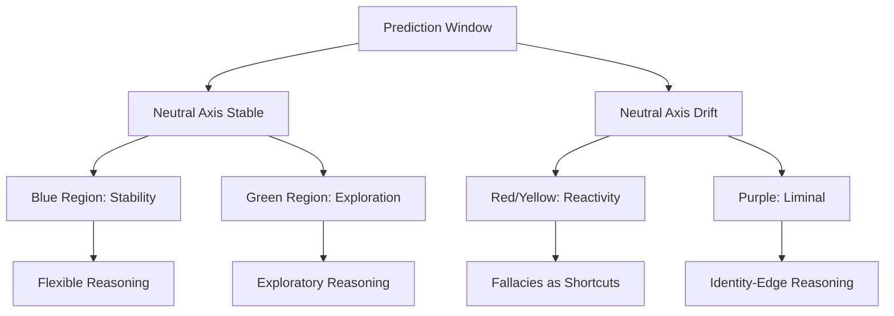

# Contract: COG → REASON
### Unified‑Model Regulatory Architecture — Contract Layer

**Expanded Filename:**  
`contract_COG_REASON_cognition_to_reasoning.md`

**Ontology Layer:**  
GEOMETRY_PREDICTION_WINDOWS

**Direction of Influence:**  
COG → REASON

**Upstream Dependencies:**  
- WINDOWS → COG  
- MOD → COG  

**Downstream Dependencies:**  
- REASON → ACTION  
- REASON → ESCALATION  

**Cross‑Contract References:**  
- `contract_WINDOWS_COG_window_geometry_to_cognition.md`  
- `contract_MOD_COG_modulation_to_cognition.md`  
- `contract_COG_REASON_ESCALATION_reasoning_collapse_modes.md`

**Canonical Bootloader:**  
https://github.com/jtrthehax/Unified-Model/blob/main/PHYSICS_SUBSTRATE_CORE/minimal_core_physics.md

**Repository Root:**  
https://github.com/jtrthehax/Unified-Model

**Primary Scientific Artifact (Zenodo DOI):**  
https://doi.org/10.5281/zenodo.20417459

---

## Contract Summary

**Input layer:** COG — prediction window width, prior weighting ratio, 
precision gain calibration state, temporal prediction window length, 
model-of-other depth

**Output layer:** REASON — option space available to inference, evidence 
discount rate, argument structure complexity, temporal integration 
horizon, source-signal vs content-signal precision allocation

**Primary crossover point:** The exhale gate — the phase in the breath 
cycle at which prediction window narrows and prior weighting increases. 
When the exhale gate becomes the dominant or chronic state rather than 
a transient phase, the precision gain pathology produces predictable, 
mechanism-specific reasoning failures.

**Key risk:** The exhale gate is a normal and necessary regulatory state 
— the precision mode that selects signal from noise. The risk is 
chronification. When the exhale gate is not a transient phase but a 
persistent operating state, the prediction window narrows not as 
functional selection but as structural constraint. At that point the 
reasoning failures listed below are not errors — they are the correct 
output of a precision-locked system doing exactly what it is designed 
to do in a context where that design is maladaptive.

**Distinguishing feature:** This is not a collapse state. Rigid-beta is 
the terminal failure — prediction window width approaches 1, curiosity 
shuts down, identity fuses with the topic. This contract describes the 
gradient before that endpoint: the zone where the prediction window is 
narrowed but not yet frozen, where reasoning is degraded but still 
occurring. The fallacies are the behavioral readout of that degradation. 
The zone is the most clinically and socially important one precisely 
because intervention is still possible.

---

## Why This Contract Is Needed

The existing contracts describe what happens to autonomic state, 
metabolic function, immune activation, and cognitive precision under 
exhale-gate dominance. None describe what happens to the structure 
of reasoning itself — the specific patterns of inferential failure 
that exhale-gate dominance produces.

The existing taxonomy of logical fallacies is a topic-based 
classification — informal fallacies, formal fallacies, appeals. 
It describes what the error looks like, not why the specific error 
and not its opposite occurred. The framework requires a mechanism-based 
grouping: each fallacy type shares a proximal mechanism, and that 
mechanism is derivable from the prediction window architecture.

The COG↔REASON contract is the output layer of the cognitive stack — 
the layer where precision state becomes visible as expressed argument 
structure. Every contract below contributes to the precision state 
arriving here. The reasoning failure is the downstream readout.

---

## Perceptual Geometry as a Template for Reasoning Geometry

### Overview

Recent advances in color-space geometry demonstrate that perceptual distortions arise when a metric lacks a defined neutral axis and exhibits state-dependent curvature. This section formalizes the parallel mechanism in the COG ↔ REASON contract: **reasoning distortions (fallacies, rigid belief structures, motivated reasoning) are geodesics computed on a mis-shaped cognitive manifold**, governed by the same invariants that structure human color perception.

---

### Neutral Axis: From Black–White to Cognitive Baseline

**Input layer (COG):**  
- prediction window width  
- prior weighting ratio  
- temporal prediction horizon  
- precision gain calibration state  

**Output layer (REASON):**  
- argument-path geometry  
- option-space topology  
- inference stability  
- fallacy class expression  

Color-space requires a **black–white axis** as a neutral reference line; all hue relationships are defined relative to this axis. Analogously, the reasoning architecture requires a **cognitive neutral axis**:

> The inhale–exhale prediction-window midpoint, where precision weighting is symmetric and priors do not dominate error signals.

When this axis is intact, option-space remains wide and reasoning remains flexible. When it collapses or drifts, the manifold folds toward one or a few attractors, producing:

- binary framing and black–white thinking  
- self-sealing priors  
- rigid, shortest-path argument chains  

These are the reasoning equivalents of hue shifts under luminance changes.

---

### Curvature: Precision Gain as a Metric Operator

In color-space, changes in luminance alter the **curvature** of the perceptual metric (Bezold–Brücke effect), bending shortest paths between colors. In the reasoning manifold, **precision gain** plays the same role:

- ↑ precision gain → ↑ curvature → geodesics bend toward dominant priors  
- ↓ precision gain → ↓ curvature → geodesics flatten → exploratory paths become accessible  

Behaviorally, increased curvature manifests as:

- motivated reasoning (evidence routed along prior-favoring paths)  
- source-over-content weighting  
- identity-fused inference  
- catastrophic extrapolation chains  

These are not logical failures; they are **energy-efficient geodesics** in a high-curvature cognitive metric.

---

### Geodesics: Shortest-Path Reasoning Under Load

A reasoning geodesic is:

> The minimal-effort inference path through the current cognitive metric, given prediction-window width and precision gain.

Healthy state (low curvature, stable axis):

- long geodesics  
- high argument-structure complexity  
- preserved counterfactuals  
- wide option-space

Distorted state (high curvature, axis drift):

- short, steep geodesics  
- brittle, linear reasoning  
- loss of counterfactuals  
- fallacy patterns as optimal shortcuts

Thus, fallacies are **geometric signatures** of the manifold’s current shape, not arbitrary cognitive errors.

---

### Color Regions as Regulatory Modes

Human color perception and regulatory architecture share the same metric structure, allowing color regions to serve as intuitive labels for reasoning modes:

- **Blue (near neutral axis):** stability baseline; centered prediction window, balanced precision, low curvature, anchored reasoning.  
- **Green (low-curvature region):** exploratory mode; wide window, light priors, high option-space, smooth geodesics.  
- **Red/Yellow (high-curvature region):** reactive/urgent mode; precision spikes, narrowed window, rigid shortcuts, threat-biased inference.  
- **Purple (boundary region):** liminal/identity-edge mode; self-model transitions, introspection, boundary-sensitive reasoning.

Because both color-space and the reasoning manifold are universal biological geometries, these mappings are **structural, not subjective**: the same color regions correspond to the same regulatory modes across individuals.

---

---

### Cross-Contract Dependencies

- **COG ↔ INTERO:** interoceptive precision sets baseline curvature of the reasoning manifold.  
- **MOD ↔ COG:** neuromodulatory tone dynamically adjusts curvature and prior weighting.  
- **AUTO ↔ MOD:** vagal tone stabilizes the cognitive neutral axis.  
- **SOC ↔ COG:** social complexity and unpredictability narrow the prediction window, increasing curvature susceptibility.

---

### Invariant Statement

> Reasoning distortions are geodesics computed on a mis-shaped cognitive manifold.  
> Fallacies are not failures of logic; they are the shortest paths available to a system whose neutral axis or curvature has shifted, governed by the same geometric invariants that structure human color perception.

---

## The Complete Chain — Both Directions

### COG → REASON (Cognitive precision state drives reasoning quality):
Prediction window width  
→ Option space available to inference  
→ Evidence discount rate applied to incoming signal  
→ Argument structure complexity available  
→ Temporal integration horizon  
→ Source vs content precision allocation

EXHALE-GATE DOMINANT STATE:  
Prediction window narrows  
→ Prior weighting increases  
→ Prediction errors discounted before integration  
→ Option space collapses  
→ Evidence suppression increases  
→ Temporal horizon compresses  
→ Source-identity heuristics replace content evaluation  
→ Fallacy-class output determined by which  
inference parameter is most degraded

### REASON → COG (Reasoning output feeds back into cognitive state):
Expressed reasoning  
→ Social response from interlocutors  
→ Confirmation or challenge signal  
→ Prediction error generated against social prior  
→ If confirmation: prior strengthens, window narrows further  
→ If challenge: threat response narrows window acutely  
→ Either direction tightens the exhale gate  
→ Reasoning quality degrades further  
→ Loop closes

---

## Required Crossover Point

Any claim that cognitive state produces a reasoning failure must pass 
through prediction window width → prior weighting ratio → specific 
inference parameter degradation. Direct claims that "stress causes 
illogical thinking" without specifying which inference parameter is 
degraded and in which direction violate the chain integrity requirement.

The crossover is not emotional state — it is the mechanical precision 
state. Emotion is a downstream signal of the precision state, not the 
causal variable.

---

## Fallacy Groups by Mechanism

The operating mode arriving at this contract — structural or identity —
is determined upstream by prediction-window width. See WINDOW↔COG.
The fallacy groups described below are direct outputs of identity mode,
not independent failure modes.

The six groups below map each fallacy class to its proximal mechanism. 
The fallacy type is the behavioral readout. The mechanism is why that 
specific error — and not its inverse or some other error — occurs.

---

### Group 1 — Option Space Collapse
*Mechanism: Prediction window too narrow to simultaneously hold more 
than two attractor states. The generative model cannot maintain 
competing hypotheses in parallel — it resolves to the nearest binary.*

- **False dichotomy** — only two options modeled because window cannot 
  hold the full distribution; intermediate or orthogonal options are 
  not generated, not rejected
- **Black-and-white thinking** — same mechanism applied to attribute 
  evaluation rather than options; continuous variables are binned 
  to their poles
- **Hasty generalization** — window closes before sufficient sample is 
  integrated; the prior crystallizes from insufficient evidence because 
  the system cannot sustain the open-sampling state required to 
  continue collecting

---

### Group 2 — Prior Over-Weighting / Evidence Suppression
*Mechanism: Exhale-gate dominance → precision gain shifts weight toward 
prior → prediction errors from incoming evidence discounted before 
integration. The system is running correctly — it is doing what high-
prior-weight mode is designed to do. The error is that the mode has 
become chronic rather than transient.*

- **Confirmation bias** — incoming evidence weighted against an 
  over-strong prior; disconfirming evidence generates a prediction 
  error that is suppressed rather than integrated
- **Backfire effect** — when disconfirming evidence is strong enough 
  to break through suppression, the precision mismatch generates a 
  threat response; the threat response narrows the window further, 
  strengthening the prior rather than updating it
- **Motivated reasoning** — the same suppression mechanism operating 
  with social identity as the protected variable; evidence is processed 
  through the prior's identity-preservation function before reaching 
  the updating step

---

### Group 3 — Compressed Temporal Prediction Window
*Mechanism: Narrowed prediction window collapses the temporal 
projection range → the model cannot weight future states against 
current state → decisions are made from a truncated time horizon 
that makes past investment more real than future trajectory.*

- **Sunk cost fallacy** — past investment modeled as more real than 
  future trajectory because the temporal window does not extend far 
  enough forward to make the future tractable; loss of already-spent 
  resources is overweighted against future gains
- **Hyperbolic discounting** — future outcomes discounted sharply 
  because they fall outside the active projection window; near-term 
  options are not merely preferred but the far-term options are 
  effectively invisible
- **Appeal to tradition** — historical anchor weighted because the 
  compressed window makes the past more accessible than the future; 
  "what has always been done" is inside the window, "what could be" 
  is outside it

---

### Group 4 — Precision Mis-Allocated to Social Hierarchy Signal
*Mechanism: Under high load, the system substitutes source-identity 
heuristics for content evaluation — lower metabolic cost, uses cached 
social-hierarchy priors rather than running live evidence evaluation. 
The shift is not irrational — it is the correct response to a system 
operating at reduced bandwidth that needs to allocate its remaining 
precision to the highest-priority signal. Social hierarchy is high-
priority. Content evaluation is expensive.*

- **Appeal to authority** — source identity used as precision proxy 
  for content validity; the system is not evaluating content, it is 
  reading the social signal of who said it
- **Ad hominem** — source identity used to discount content without 
  content evaluation; the same mechanism running in the negative 
  direction
- **Bandwagon** — aggregate source-count used as prior weight rather 
  than evidence quality; the social hierarchy signal is democratized 
  to a vote count, but the substitution for content evaluation is 
  identical

---

### Group 5 — Model-of-Other Simplification
*Mechanism: Holding a complex model of an interlocutor's position 
requires prediction window width; the system must simultaneously 
maintain the interlocutor's actual claim, its context, its 
qualifications, and the alternative version that would be easy to 
refute. When window narrows, the interlocutor model is simplified 
to fit available modeling depth. The simplification is not deliberate 
— the system cannot hold the full model and generates the closest 
version it can reach.*

- **Straw man** — interlocutor model simplified to the version that 
  fits within current window; the simplified version is addressed 
  instead of the actual position; the error is not dishonesty but 
  modeling depth failure
- **False attribution of intent** — intent inferred from simplified 
  model rather than from actual expressed evidence; the system fills 
  the modeling gap with cached social priors about what people who 
  say this kind of thing usually intend
- **Mind-reading errors broadly** — interlocutor's internal state 
  projected from simplified social priors rather than from live signal, 
  because the window is too narrow to update the model in real time; 
  the interlocutor is treated as a type rather than as a specific agent

---

### Group 6 — Runaway Prior Without Correction Point
*Mechanism: Prediction chain extends forward without update 
checkpoints — each step in the chain increases prior confidence 
rather than generating falsifiable branch points. The chain produces 
internally consistent narrative that the system cannot interrupt 
because interruption requires holding a competing hypothesis in 
parallel, which requires prediction window width the system no longer 
has. The chain does not feel like speculation — it feels like 
deduction.*

- **Slippery slope** — each step in the chain treated as certain, 
  compounding confidence without evidence; no update points inserted 
  because the system cannot hold the branch structure that would 
  require them
- **Catastrophizing** — same chain structure, terminal state is a 
  worst-case attractor; the prior-confirmation loop makes each step 
  feel more certain than the previous one
- **Paranoid ideation** — at high load, the chain becomes self-sealing; 
  any evidence is interpreted as consistent with the prior, update 
  checkpoints are treated as threats rather than as correction 
  opportunities; the chain has become its own evidence

---

## The Feedback Loop

The REASON→COG direction is where the contract is most dangerous. 
Expressed fallacious reasoning does not simply produce a wrong 
conclusion — it produces a social interaction that tends to narrow 
the prediction window further.

Confirmation from others who share the prior: prior strengthens, 
window narrows, next reasoning cycle starts from a tighter prior.

Challenge from others who hold a different prior: generates a 
threat prediction error against the social-identity prior, 
narrows the window acutely, the Group 2 mechanisms activate to 
protect the prior under threat.

Either direction tends toward tighter, not looser, constraint. 
This is why high-load social environments produce reasoning 
degradation that compounds across the interaction. The initial 
precision state determines the fallacy class. The interaction 
history determines how rapidly the precision state deteriorates.

---

## Operating States

| State | Prediction Window | Primary Failure Group | Intervention Access |
|---|---|---|---|
| **Regulated baseline** | Wide, oscillating | None active | Full |
| **Mild exhale-gate dominance** | Slightly narrowed | Group 1 and 2 emerging | High — window still mobile |
| **Moderate exhale-gate dominance** | Narrowed | Groups 1–4 active | Moderate — requires regulatory input |
| **Chronic exhale-gate** | Structurally narrowed | All six groups potentially active | Low — requires contract-level intervention |
| **Approaching rigid-beta** | Near-frozen | Groups 2 and 6 dominant, self-sealing | Minimal — prior has become identity-fused |
| **Rigid-beta** | Frozen at width ≈ 1 | Fallacy is not an error but the only available output | Outside this contract's scope |

---

## Prohibited Crossings

- Direct claim that "emotional state" produces logical errors without 
  specifying which inference parameter is degraded and by which mechanism
- Direct claim that "stress" causes fallacies without routing through 
  exhale-gate dominance → prediction window width → specific Group mechanism
- Grouping fallacies by topic rather than by mechanism — topic-based 
  classification describes the error's subject matter, not its generative 
  mechanism; this contract requires mechanism-based grouping
- Claiming any fallacy group is exclusive to the named state — precision 
  is a continuous variable and fallacy tendency tracks it continuously; 
  the groups describe the primary mechanism, not binary presence/absence

---

## Failure Modes

**Treating fallacies as intelligence failures:**
The standard educational framing treats logical fallacies as errors 
correctable by learning the rules of valid argument. The framework 
says the errors are not produced by ignorance of logic — they are 
produced by a precision state in which valid argument structure is 
not accessible regardless of what the person knows. Teaching fallacy 
recognition to someone in chronic exhale-gate dominance addresses the 
wrong level. The intervention that changes fallacy frequency is 
precision state restoration, not logical training.

**Treating the feedback loop as information exchange:**
High-conflict argument is typically framed as two people exchanging 
evidence and reasoning. The contract says high-conflict argument is 
typically two people in compressed prediction windows generating 
social threat prediction errors that narrow both windows further with 
each exchange. The content of the argument has less effect on its 
outcome than the autonomic states the participants arrive with and 
the autonomic states the interaction produces. Interventions at the 
content layer — better evidence, clearer logic — are working against 
a mechanism running below the content layer.

**Missing the Group transition:**
A person who begins a conversation showing Group 1 errors (option 
space collapse) and ends showing Group 6 errors (runaway chain) has 
moved through progressive window narrowing across the interaction. 
The shift in fallacy class is a window-narrowing indicator. Treating 
each error in isolation misses the trajectory signal that the 
sequence carries.

---

## Adjacent Contracts

**Below — feeds into this contract:**
- AUTO ↔ MOD: Vagal tone → ECS calibration → precision gain 
  calibration → prediction window width; this contract receives 
  the precision state that AUTO↔MOD produces
- MOD ↔ COG: Neurotransmitter environment → prediction error 
  weighting → cognitive flexibility; the specific precision gain 
  that enters this contract is calibrated here

**This contract is downstream of:**
- COG ↔ INTERO: Interoceptive prior quality affects what kind of 
  prediction errors the cognitive system generates, which affects 
  which Group mechanisms are most pre-activated

**The collapse trajectory:**
- COG ↔ REASON terminates at rigid-beta's approach. At rigid-beta 
  itself the contract no longer applies — reasoning has not degraded, 
  it has been replaced. The contract covers the gradient, not the 
  endpoint. Rigid-beta belongs to the failure modes taxonomy, not 
  to this contract.

**Lateral:**
- SOC ↔ COG: Social cognitive load from the SOC↔COG contract 
  consumes prediction window width that would otherwise be available 
  for reasoning. The ND masking overhead documented in SOC↔COG 
  directly reduces the modeling depth available for Group 5 — 
  running a parallel masking simulation while also trying to maintain 
  a complex model of the interlocutor's position produces Group 5 
  failure not from cognitive deficit but from resource competition

---

## Origin Note

This contract was derived from the observation that the exhale gate 
was mechanically defined and its prediction window narrowing was 
mechanically defined, but the specific downstream output — what 
kind of reasoning the narrowed system produces — had no formal 
location in the stack.

The existing fallacy taxonomy classifies by topic. The framework 
requires classification by mechanism. The question that generated 
this contract: if you know the prediction window is narrowed and 
the prior is over-weighted, which errors are derivable from first 
principles — and do those derived errors match the observed 
catalogue of recognized fallacies?

They do. Every Group above was derived mechanistically before 
checking the fallacy literature for confirmation. The one-to-one 
correspondence between specific precision failures and specific 
named fallacies is the load-bearing observation — it means the 
fallacy taxonomy was empirically discovering the output layer of 
the precision state without having the mechanistic language to 
explain what it was finding.

The feedback loop — that expressing fallacious reasoning tends 
to narrow the window further regardless of whether challenge or 
confirmation follows — was derived from the prediction window 
architecture and is the most clinically important implication. 
It predicts that high-conflict social environments are 
cognitively degrading not through emotional upset but through 
precision state compression, and that the degradation is 
self-amplifying within the interaction.

*Chain status: Group mechanisms 1–6 are scaffolding — the 
component links (prediction window width, prior weighting, 
temporal compression, precision allocation) are load-bearing 
from upstream contracts; the specific fallacy-to-mechanism 
mappings are framework derivations awaiting direct empirical 
assembly. The feedback loop is scaffolding with strong 
mechanistic derivation. The prediction that precision state 
restoration reduces fallacy frequency independently of 
logical training is the primary testable prediction.*
